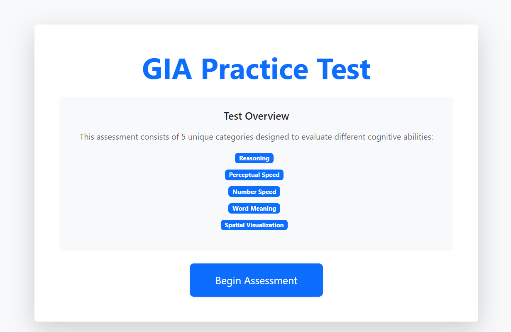
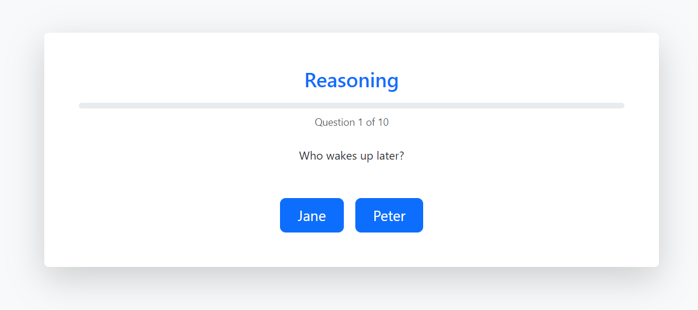
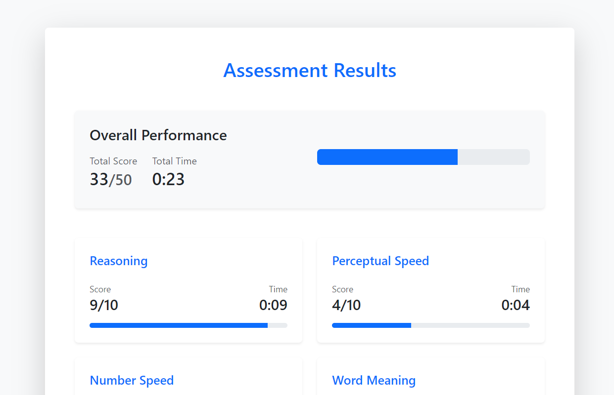

# GIA Practice Test
General Intelligence Assessment (GIA) is a speed test that measures your ability to quickly learn, comprehend and retain information.

The test has 5 sections, each taking 2-3 minutes:

- Perceptual Speed
- Reasoning
- Number Speed and Accuracy
- Spatial Visualisation
- Word Meaning

**Disclaimer ⚠️**

This project was developed independently by me as a practice resource for the GIA test.

This mock test is not affiliated with any official test providers. It is solely a practice tool that includes sample questions for study purposes.

## Demo

**Access Demo Site:**
https://timely-snickerdoodle-e1ba62.netlify.app/

## Contribute

Contributions are welcome! Here are some ways to help improve this project:

- Expand and refine the question bank.
- Spatial Visualisation section needs improvements.

  

